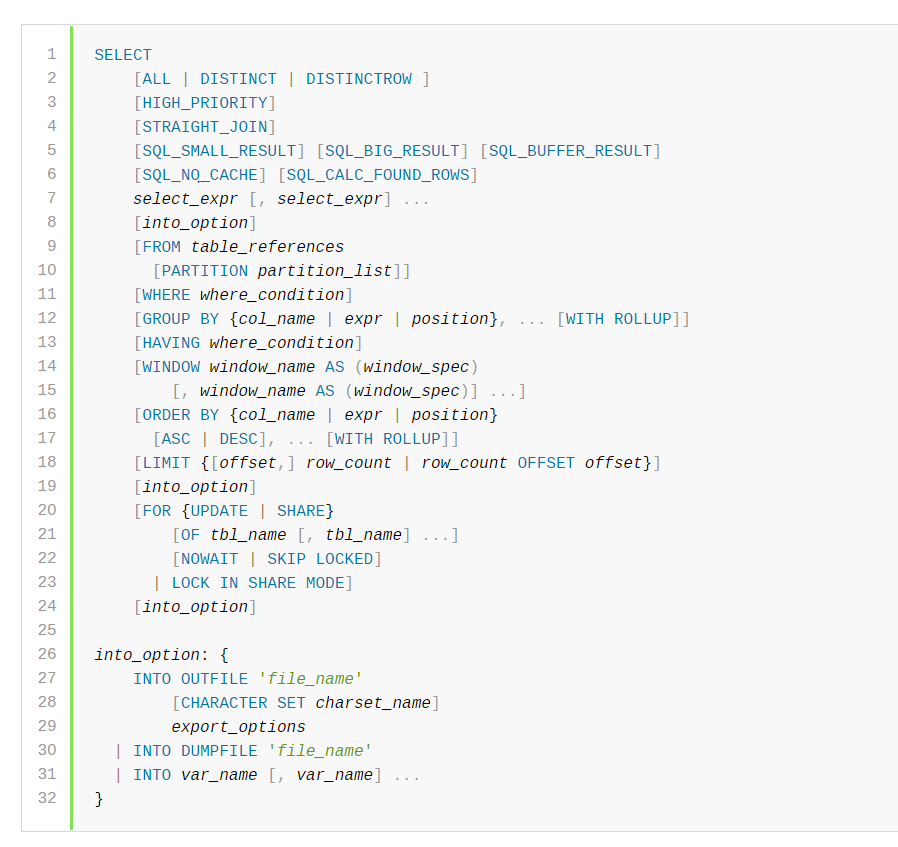

# 设计思路

`EQL`从某种程度上来说，只是我关于`ORM`计划的一个起点。我在维护 `Beego` 的`ORM`的时候，以及在使用`GORM`，`Java`的`Mybatis`, `Hibernate`的时候，意识到这样一个问题：`ORM`框架，严格来说，应该是可以分成三个部分的：

- 查询语言：也就是`EQL`这块，它主要是负责生成`SQL`，以及运行`SQL`的参数；
- 结果集处理：也就是将`SQL`查询结果转化为结构体，或者集合，该部分的典型例子是`sqlx`，这个部分初步的名字是`EMP`；
- 结合层：将查询语言和结果集处理两个粘在一起，对外表现出来的样子，就是`ORM`。如果考虑得更加复杂一点，那么数据源管理，比如说测试库切换，以及分库分表，都可以尝试在这一层上来完成；

其中查询语言和结果集处理，非常独立，以至于完全可以独立出来作为一个库，也可以被单独使用。在我的设想中：

1. 用户可以尝试结合`EQL`和`sqlx`，利用`EQL`来生成`SQL`，利用`sqlx`来将结果集组装为对象；
2. 用户可以尝试使用`EQL`与其它`ORM`，利用`EQL`来生成`SQL`，调用其它`ORM`的`RawSQL`方法；
3. 用户可以自己手写`SQL`，然后自己用`sql`库运行拿到结果集，然后丢到`EMP`，`EMP`来完成对象组装；
4. 用户可以利用`EMP`或`EQL`中的任何一个部分，或者两个部分，设计自己的`ORM`框架。也就是意味着有了`EQL`和`EMP`，设计`ORM`框架的事情，应该是一个稍微具有经验的开发就能够胜任的工作。任何一个`ORM`框架都无法满足所有人对`ORM`的期望，所以与其求人，不如求己，利用`EQL`和`EMP`自己设计自己需要的`ORM`；

因此，第一步，就是设计一个`EQL`，即查询语言。

## EQL 设计要点

一个查询语言的设计，第一点是要做到**完备性**。即我们的目标是能够支持全部的`SQL`语法特性。但是实际上，这是一个近乎不可能的任务，即便只考虑`MySQL`也是一个几乎不可能的问题。更何况，`EQL`的目标是能够兼容卷大多数的方言。

即便我只寻求尽可能完备，但是对于设计`API`来说也是一个巨大的挑战。比如说，这是`MySQL`上的`SELECT`语句的规范：



鉴于此，我肯定没办法在第一个版本的时候就支持所有的特性，因此，设计`API`的第二个点，是要**易扩展**。这个易扩展不是指我一个接口容易写好几个实现的易扩展，而是容易不断加方法来支持新的语法特性。

还要考虑的一点是，`API`应该是**符合直觉的**。也就是，即便用户在不看文档的情况，仅仅是通过`IDE`的提示，他也应该能直接学会如何使用。这要求的是，有什么方法，方法名字叫啥，以及参数是啥，都应该是符合大多数人的淳朴的认知的。

最后一点，则是要保证一种向后**兼容性**。用户肯定不会希望，升级了一个版本之后，原来的方法就不再能够使用了。向后兼容性这个要求，迫使我们在设计每一个方法的时候，都要谨慎行事，也迫使在实现的时候，尽量不暴露细节。

我早期看过很多的`ORM`的查询语言的设计，大体上，在`GO`这边，模式都是类似的：

```go
type Orm interface {
    Create(val...interface)
    Update() 
    Delete()
    Query() *QueryBuilder
}
```
首先是几乎都有一个大一统的`ORM`接口。该接口提供了主要的增删改查方法，有一些还额外提供了类似于`QueryBuilder`的接口，用于构造复杂的查询。显然，前者，大一统的`ORM`接口是完全无法满足**完备性**和**扩展性**。

## Builder 模式

因此我一直在寻求一种更加优雅的设计。

后来机缘巧合接触了一个新的`ORM`之后，得到了极大的启发：`SQL`的构建，是`Builder`模式的最佳使用场景。正如我前面提到，其实别的框架里面也有类似`Builder`的东西，比如说`Beego`里面有一个`QueryBuilder`。不过一直以来它都是作为一个辅助接口，核心接口是`Orm`接口，导致我一直对它重视不够，所谓灯下黑也不过如此。另外一个原因是我早期尝试设计`Builder`的时候，走上了歧途：

```go
type Builder interface {
    Build() Query
    // 一些构造公共子部分的方法
    BuildWhere()
}
type SelectBuilder interface {
    // 一些用于构造 Select 的方法
}
```

在这种设计之下，不同的方法会有不同的实现，因此可以保证做到方便横向扩展。

但是使用这种设计也意味着，我每次需要增加一个语法特性，就要在上面增加一个方法。还有一个非常非常难以解决的问题：方言语法特性不兼容。比如说，在`PGSQL`里面，`upsert`的语法是`ON CONCLICT`，而`MySQL`的语法是`OnDuplicateKey`。这两者之间的语法差异还是挺大，因此难以在`SelectBuilder`里面加上一个大一统的这种触发`upsert`的方法。就最简单的命名来说，使用`OnConflict`导致`MySQL`用户看起来这个方法不够直观，使用`OnDuplicateKey`，`PGSQL`看起来不够直观。不够直观就意味着他需要找文档，看例子才能学会如何使用。

在这之后，我突然就想通了两个问题：
- 我实际上只需要一个`Builder`接口，该接口就是返回`SQL`和参数，以及`error`。`error`用于判断是否构造成功；
- 具体的如何构造，我完全不需要在`Builder`里面定义方法，就各自实现类里面去定义方法

所以，`EQL`就有了最顶级的接口设计：

```go
// QueryBuilder is used to build a query
type QueryBuilder interface {
	Build() (*Query, error)
}

// Query represents a query
type Query struct {
	SQL string
	Args []interface{}
}
```

该接口是最最核心的接口，剩余的一切结构体和接口，都是为这个服务的。

目前基于该接口直接有四个实现：
- `SELECTOR`
- `UPDATER`
- `DELETER`
- `INSERTER`

### 方法命名、参数以及构造SQL

以设计`SELECTOR`为例，展示一下方法命名、参数和一些构造`SQL`上的注意点。

首先第一条原则是：**遵循`SQL`的命名**。也就是说，`SQL`里面叫啥，`EQL`里面的方法就叫啥。这是`EQL`在`API`设计上显著不同于别的`ORM`框架的点，也显著不同于我司的`ORM`。

> 从一个`ORM`的角度来说，这条原则是错的。因为`ORM`在用户看来，方法命名应该遵循面向对象的那一套。比如说，`INSERTER`应该叫做`CREATOR`会更加符合面向对象的感觉

所以，我期望的用户用`EQL`就像写一条`SQL`：

```go
Select("Id", "Name").From(&TestModel{}).Where(predicates).OrderBy("Id DESC").Offset(10).Limit(100).Build()
```
在参数传递上，传递的是**字段名**，而不是列名。这是第二条原则：**用户在操作所有的`API`的时候，都应该传递的是`GO`（应用层面）层面上的信息，而不是数据库层面上的信息**。例如`Name`是`Go`中结构体字段的名字，与之对应的列名应该是`name`。在这种场景下，`EQL`将完成`Go`语言层面到数据库层面的映射。

最终，用户通过调用`Build`方法来拿到`SQL`和`SQL`的参数。然而，我期望用户按照这样一种很自然的，和自己写`SQL`差不多的顺序来调用方法，最终完成`SQL`的构建。但是其实用户是不一定会按照期望的顺序来的。比如说他可能把`OrderBy`放在`Where`之前，在这种时候，我还是期望用户能够得到正确的结果。因为在有些时候，用户自己也不能控制住顺序，特别是在一些根据条件来构造的情况。

所以，`Build`方法就承担了最重要的职责，也就是我们的第三条原则：**`SQL`的构造仅能在`Build`方法中完成**。由此又可以将这些`Builder`的方法分成两类：
- 终结方法：`Build`；
- 中间方法：其它方法。这些方法的职责就是保存一份配置，比如说用户调用了`Where`，那么应该把`Where`的输入保存下来，最终在`Build`方法里面把`Where`构造出来；

这种机制，还额外带来了两个收益：

- 将内存分配集中在`Build`方法中：意味着，可以使用一个`strings.Builder`来完成整个`SQL`构建。同时也可以在将来考虑内存复用——比如说使用`sync.Pool`来缓存`buffer`；
- 快速失败：在`Build`中构造`SQL`，那么任何一个部分失败之后，后面的部分就不需要再执行下去了。而其它方法因为非常轻量，所以开销非常小；

另外还有一个约束：**所有的`API`，如果参数是模型，那么应该只接收指针**。这应该作为一条一致性的契约，贯穿所有的公共`API`设计。这样带来两方面的好处，一者是用户不必考虑是否应该传入指针；另外一个是实现的时候也不必次次都检查和转换。这属于和用户的一种默契与约定。

## DB 抽象

即便`EQL`并不需要真的执行`SQL`，但是`EQL`依旧需要一个`DB`的抽象，它主要承担的作用就是维护一些“配置”，或者说和`DB`相关的元数据，例如说方言。
```go
type DB interface {
    dialect dialect
    registry MetaRegistry
}

type dialect struct {

}
```

同时还要维持所有的表元数据，表元数据可以看**元数据**一章。

## 元数据

在构造`EQL`的时候，需要知道一些表的元数据，比如说表名、字段名。它们通常是通过解析结构体来得到的。

因此需要考虑两个维度的元数据，表层次上的元数据和列层次上的元数据。再进一步考虑到`EQL`的定位——可以与别的`ORM`框架（包括EMP）结合，那么显然要存在一种机制，允许用户自定义如何解析元数据。

因此元数据的解决方案，要涉及两方面：元数据定义本身和元数据提供者。对应到`EQL`，就是三个接口：

```go
type TableMeta struct {
}

type ColumnMeta struct {

}

type MetaRegistry interface {
	Get(table interface{}) (*TableMeta, error)
	Register(table interface{}) error
}
```

`EQL`本身提供一种默认实现，该默认实现是基于反射和`Tag`，从结构体中解析出来。例如说以`eql`作为`Tag`，那么结构体定义形如：
```go
type User struct {
    Email string `eql:"unque_index",
}
```

### 默认解析

默认解析应该遵循的原则：
1. 表名字段名应该遵循：驼峰转下划线。例如`OrderDetail`对应的表名是`order_detail`，而字段`FirstName`对应得是`first_name`；

### 自定义元数据

有些时候需要提供一些接口来允许用户自定义一些信息，比如说表名，字段名到列名的映射。用于解决这么一类典型场景：
1. 用户拿到的结构体是第三方的结构体，因而用户无法在字段上加上`eql`的`Tag`。这种需求在使用`IDL`的公司较为常见。例如`protobuf`，`swagger`等；
2. 用户不满意于默认规则，例如按照约定`User`这个结构体对应的表名是`user`，而`user`在数据库里面有自己的含义，因此用户希望换成`user_tab`。大多数时候，也可能是因为公司有命名规范，比如说所有的表名，起始都应该是`t_`；

要同时满足着两个场景，需要考虑引入注册的过程：

```go
type MetaOption func(meta *TableMeta)

func WithTableName(tn string) MetaOption {
	return func(meta *TableMeta) {
		meta.Name = tn
	}
}

registry.Register(&User{}, opts)
```
`opts`就是用户传入的各种自定义的修改方法。

### MetaRegistry 实现要点

#### 缓存

元数据应当是可以被缓存的。一个表结构在系统运行期间是稳定的。毕竟如果要增加字段或者修改字段，无法避免的需要修改代码，因而自然就会重启。所以元数据缓存之后是可以完全不考虑淘汰的问题的。

但是另外一个问题是，如果元数据是可以缓存的，那么我是否应该在应用启动之前，强制要求用户注册所有的模型？

```go
registry.Init(&User)
app.Run() //...
```
这个问题的答案是：取决于`MetaRegistry`的实现。即我认为，用户出于性能考虑可以自己提供一种提前注册的实现。因为“是否缓存以及如何预热缓存”，完全是属于`MetaRegistry`的实现细节。

在`EQL`的默认实现里，因为要解决**自定义元数据**的问题，所以必然是要提供注册的方法，而且为了简化操作，应该附加在`DB`上，这样一来，还可以强化用户将`DB`作为全局唯一实例来使用：

```go
func (d *DB) RegisterTable(table interface) error {
    d.registry.Register(table)
}
```

#### 维度

在考虑应用缓存的时候，就要考虑另外一个问题：`MetaRegistry`的维度问题。

理想情况下，因为元数据是和表相关，而表是归属于数据库的，所以理论上来说，`MetaRegistry`和`DB`应该是一比一的关系，即一个`DB`有一个`Factory`。但是在当前的设计下，无法限制用户对于一个`DB`只创建一个实例，他可能在局部变量里面创建`DB`。

例如我期望的是：
```go

userDB := eql.New(opts)

func Biz1() {
    userDB.Select() //...
}

func Biz2() {
    userDB.Select() //...
}
```
而用户可能用法是：
```go
func Biz1() {
    eql.New(opts).Select() //...
}

func Biz2() {
    eql.New(opts).Select() //...
}
```
如果采用全局唯一实例，那么就要考虑模型冲突的问题。即在多数据库系统中，可能在多个数据库中都有同样的叫做`User`的表，但是在结构上有细微的不同。


## 方言兼容方案

方言兼容方案，主要是两个角度：
- 方言独有语法特性；
- 所有（或者大多数）都有的特性，但是实现上有细微差别；

对于第一个点来说，很好办，直接衍生出来一个新的`Builder`，这个`Builder`是针对特定方言的。用`upsert`来举例子，`Inserter`里面，提供了两个方法来返回不同方言的`Upserter`：

```go
// OnDuplicateKey generate MysqlUpserter
// if the dialect is not MySQL, it will panic
func (i *Inserter) OnDuplicateKey() *MysqlUpserter {
	panic("implement me")
}

// OnConflict generate PgSQLUpserter
// if the dialect is not PgSQL, it will panic
func (i *Inserter) OnConflict(cs ...string) *PgSQLUpserter {
	panic("implement me")
}
```
注意的是`Inserter`，对于大多数方言都是一样的，只有在过渡到`upsert`语句的时候，开始分叉。例如在`PgSQL`里面，标记着`upsert`是`ON CONFLICT`，那么使用`PgSQL`的人，在使用`Inserter`的时候，会下意识地选择`OnConflict`。同样的道理，`MySQL`的用户天然就知道自己应该使用`OnDuplicateKey`。

> 当然，这也会给一些用户，同时知晓`MySQL`和`PgSQL`，或者很聪明的人，带来一些困惑，就是我该用哪个，但是只要看到返回值，或者方法注释，应该也是很容易就理解的。

针对第二点，最典型的例子是引号，比如说字符串的引号，字段名的引号，不同方言都有自己的特点。这一类，通过引入`dialect`的抽象来解决：

```go
type dialect struct {
    quote byte // MySQL => `
}
```

## 类型安全

`EQL`设计的一个很重要的考量是类型安全。有一些`ORM`框架的`API`充斥着`interface{}`作为类型参数，然后在使用的时候，因为`interface{}`可以接收任意的值，有时候就会陷入一种困惑中，即它会怎么处理我传入的值？

因此这一次`EQL`会加强这一方面的检查。这带来的后果是限制了用户的自由度，另外一方面就是可以在编译期及时发现问题。最为典型的例子是`Order By`。在`EQL`处理`Order By`上并不是让用户传入一个片段：`Id DESC`或者`Id ASC`，而是：
```go
// ASC means ORDER BY fields ASC
func ASC(fields...string) OrderBy {
	panic("implement me")
}

// DESC means ORDER BY fields DESC
func DESC(fields...string) OrderBy {
	panic("implement me")
}
```

另外一个典型的例子是`Select`的方法：
```go
// Select starts a select query. If columns are empty, all columns will be fetched
func (*DB) Select(columns...Selectable) *Selector {
	panic("implement me")
}
```
这个方法里面，接收一个`Selectable`参数。一般情况下，`SELECT`后面可以跟两种：列名和聚合函数。大多数`ORM`的框架，对此的处理是由用户保证自己输入的正确性，例如说它们的设计可能是要求用户输入字符串，`Select("Avg(age) as avg_age")`，这并非不可以。但是这里面有一个隐患，就是用户必须要知道列名是什么——大多数时候这并不是一个问题。另外一个就是，我认为这种写法对用户实在不太友好。

因此在`EQL`这种设计之下，实现这个类似的写法，实际上是`eql.Avg("Age").As("avg_age")`。在这种写法之下，`EQL`可以帮助检测`Age`这个究竟是否存在，并且将`Age`这个字段名，映射为准确的列名。

前面的`方法命名、参数以及构造SQL`里面说到，所有的方法，接收的参数都应该是列名或者结构体名，而不是表名和列名。这是因为，我认为在模型和表之间是存在映射的。`EQL`作为一个`ORM`的一部分，那么应该操作的是模型，所以应该用模型的名字而不是表的名字。

也正因为这一个要求，`EQL`可以帮助用户避免很多低级错误，比如说手抖写错的问题。

### 标记接口
要想实现类型安全，就需要大量采用，我称之为标记接口的设计思路。从实践上来说，也难说好与不好，只能算是我个人比较偏好这种方案。

所谓的标记接口，就是定义了接口，但是它内部的方法没有任何效果。例如：
```go
type Assignable interface {
	assign()
}

type Expr interface {
	expr() (string, error)
}
```
目前来看，`EQL`并不会使用到里面的`assign`或者`expr`方法。所以这两个接口存在的意思就是标记一下，然后用于别的接口。

在使用标记接口的情况下，`EQL`可以给很多的结构体实现这种接口，从而可以被用于各种场合，而且不会引起别的问题。例如说典型的两个`columns`和`Column`结构体：
```go
func (Column) assign() {
	panic("implement me")
}

func (Column) expr() (string, error) {
	panic("implement me")
}

func (Column) selected() {
	panic("implement me")
}
```

## 表达式 Expression

在设计 API 的时候，绕不过去的一个坎，就是稍微有点复杂的表达式。如果是太复杂的表达式，我大可以说，太复杂了不支持，用`RawSQL`；而如果是很简单的，那么支持起来就不费劲。问题就出在，那些说复杂不是特别复杂，说不复杂但是又有点复杂的东西。

这里我主要考虑的就是两大类：
- 方法调用
- 数学表达式

方法调用不难，无非就是一个方法名和参数的问题。数学表达式，众所周知，是一个复杂的结构，因为表达式还可以和表达式嵌套，最终形成的就是一个类似于`AST`的东西。在进一步考虑之后，我发现，`SQL`因为允许列和列的运算，所以看上去更加像是代数表达式，比如说：
- `a`+`b`+`c`
- (`a`+10)*100

也就是参数就是两类，一类是列，一类是值。所以在表达式里面，最基本的两个元素，就是列和值。两者和操作符结合，生成一个基本的表达式，例如`a+1`。这种简单表达式可以和另外一个表达式以操作符结合，生成复杂的表达式，例如`(a+1)*10`，或者`(a+1)*(B+9)`。这种都是二元操作符，也就是：
```go
type binaryExpr struct {
	left Expr
	op op
	right Expr
}

type MathExpr binaryExpr
```
很显然，列也是作为一种表达式：
```go
func (Column) expr() (string, error) {
	panic("implement me")
}
```
在这个基础上，可以定义基本的四则运算：
```go
func (Column) Inc(val interface{}) MathExpr {
	panic("implement me")
}
```
这一类的表达式一般出现在两个地方：
- 赋值类的地方，例如`Update`语句的`Set`片段，或者`Upsert`的`Update`子句
- 条件。比如说`WHERE`和`HAVING`两个地方

## NULL 语义

`NULL` 语义是在 `ORM` 设计上的一个极大的难点。它不仅仅是一个技术问题，也是一个规范问题。因此在考虑`NULL`设计的时候，我首先要确认下来，在这一个新的`ORM`框架里面，我认为什么样的实践才是好的实践，也可以说，这个`ORM`会把什么当做是“自然的”，而把什么当做是需要付出额外努力的。

> 这就是体现了中间件设计的另外一个点，你不仅仅是在设计一个中间件，你也是在推广你的理念

这些是设计解决方案时候要遵循的基本原则：
- 尽量不使用支持`NULL`的列
- 即便使用`NULL`，也不要使用默认值

站在这个角度，基本上我就不太考虑各种奇诡的用法了。所以在`EQL`里面，`NULL`可以和`nil`等价。也就是说，所谓的可以为`NULL`的列，也就是那些使用指针的字段。

这会对`UPDATE`和`INSERT`产生影响。本来也会对`DDL`产生影响，但是目前来看，我暂时没有支持`DDL`的确切计划。

### INSERT

`INSERT`将会遵循一种特别朴素的做法，就是全部字段插入。某些框架会考虑部分插入以节省性能损耗，比如说忽略全部的`NULL`字段，但是实际上这种取舍是没有太大价值的，毕竟数据库的瓶颈不会因为你少了几个`NULL`就有改进。

唯独对主键，我们需要考虑特殊场景。因为我前面提到，我希望大家不要用`NULL`的列，那么显然主键就不会用指针来声明了，比如说：
```go
type User struct {
	Id int64
}
```
在这种情况下，如果`id`是`0`的话，我们是会插入这个`0`的，这可能会出错，或者把主键设置为一个`0`。

那么我的解决方案有两个：
1. 如果检测到是自增主键，我把`0`替换为`nil`。插入到数据库里面，那么数据库依旧会自增；
2. 我不会偷偷替换，我提供一个选项，用户指定为`true`的时候，我才会执行这种逻辑；

它们的区别就在于，是否需要这个选项。也就是偷偷把`0`值替换为`nil`是否是一个自然的选择？

我认为是自然的。

所以在`EQL`里面，它会把自增主键的`0`替换为`nil`。其余的列，则是保持不变。

### UPDATE

`UPDATE`的语义就比较复杂，要考虑两个情况，`nil`和`0`值。大部分情况下，`ORM`框架都会选择在更新的时候忽略掉这两个值的字段。这是因为在`Go`里面无法区别用户是没有设置值，还是用户设置了值，就是把值设置成为了`nil`和`0`。

考虑到大多数场景都是用户没有设置值，因此`UPDATE`的语义，会变成如果这是一个`nil`或者`0`值，那么我会忽略掉它们。当然，在`Go`里面，从反射的意义上来说，都可以称为零值（`zero value`）

不过，据我观察，会有很多用户在网上搜索`GORM`如何把字段更新为`0`一类的问题，所以要提供一个选项，允许用户使用这些零值。因此会提供两个选项：
- `WithNil`：会用`nil`来更新字段，这意味着会把数据更新成`NULL`
- `WithZero`：会用`0`来更新字段

但是这两个选项是对整个结构体生效的，要想更新单一字段为`nil`或者`0`，需要用到前面的表达式，这里就不再赘述了。

## Raw SQL 兜底

所有的`ORM`都面临一个问题，就是在自身`API`无法覆盖所有的场景的时候，不得不提供一个所谓的`Raw SQL`的方法，也就是直接执行用户手写的`SQL`。`EQL`也面临类似的问题。不管如何设计，`EQL`都会遇到无法支持的场景。在这种时候，提供`Raw SQL`就是一种不得已的举动了。

但是，`EQL`的定位本身就是提供给用户写`SQL`。如果`EQL`也提供了`Raw SQL`的话，那么用户为什么不直接自己手写`SQL`呢？

答案就是，`EQL`只提供某些片段的`Raw SQL`的支持。例如一个典型的场景`SELECT COUNT(DISTINCT ID)`，`COUNT (DISTINCT ID)`是一个聚合函数，一个复杂的聚合函数。那么问题来了，`EQL`为了维系自身的简单，所以没有特别强大的动力去支持这么一种场景，毕竟可能一万个用户里面也没有一个用户会使用这个东西。因此在这种场景下，应该允许用户传入自己的这个复杂片段。

用户应该意识到，当他决定使用`EQL`的这个特性的时候，他对正确性负有全部责任。也就是说，`EQL`完全没法子提供任何有效的验证——实际上，大多数时候，`EQL`是把这个作为字符串直接进行拼接。也因此，如果用户不小心写错了列名，那么`EQL`是发现不了的，只能在执行阶段才能知道。而通常来说，使用`Raw SQL`的特性，意味着用户必须要对`EQL`的内部工作机制有一定的了解，否则的话，他输入的`SQL`片段，很可能在拼接之后导致整个`SQL`出错。

整体来说，`EQL`提供`Raw SQL`是一个不得已的行为，并且也是不鼓励用户使用。

## 规范胜于兼容

其实很大程度上，做一个开源软件，也是输出一套规范。最典型的例子就是`Go`语言本身就是输出了很多规范和理念。同样的道理，我在尝试设计的`EQL`的过程，本身也是输出一个规范的过程。

我在维护很多开源项目的时候，意识到一个问题，很多开源项目的腐化是源于希望尽可能兼容各种用户的偏好用法，而没有去探究这种用法是否是一种好的实践。比如说我一直深恶痛绝的，大多数用户在使用`ORM`的时候会直接创建一个实例，例如：
```go
func MyBusiness() {
	o := NewOrm()
}
```

而我之所以觉得这是一个很糟糕的实践，就是因为我认为 ORM 本身应该是一个无状态的，这意味着你可以直接在全局维护一个实例，不需要这样频繁创建。无论是从工程的角度，还是从性能的角度，这都是一个很糟的实践。

在`ORM`应该在应用启动过程中就初始化好这种用法之下，我就可以把大多数可配置的东西，挪到创建过程，而不是放到运行过程。参考**创建定义行为而不是运行时分发行为**

## 创建定义行为而不是运行时分发行为

为了使得代码简洁，并且使得性能良好，我的一个很重要的设计原则就是，在创建实例的过程中就定义好各种行为。举个例子来说：
```go
func (o *Orm) DoSomething() {
	if flag {
		doA()
	} else {
		doB()
	}
}
```

而我完全可以在创建的时候判断`flag`从而在运行的时候根本不需要考虑`if-else`，避开分支预测失败的乘法。同样的，代码也更加清晰：
```go
func NewOrm(flag bool) *Orm {
	o := &Orm{}
	if flag {
		o.handler = doA
	} else {
		o.handler = doB
	}
}

func (o *Orm) DoSomething() {
	o.handler()
}
```

## 启用泛型

这一次，因为恰好`GO`的泛型方案也快要出来了，所以这一次会直接启用`Go1.17`之后的版本，在有必要的时候启用泛型。

目前来看，`EQL` 本身能够应用到泛型的场景还是非常少，只有一个`INSERT`在批量插入的时候，为了限制住用户同时插入不同的表，才有使用泛型的必要，其余情况，都没有特别强力的需要泛型的动机。

不过目测在`EMP`里面就要启用泛型了。

另外现在不立刻启用泛型，也是因为`IDE`对泛型的支持还不是很好，代码写起来特别累。